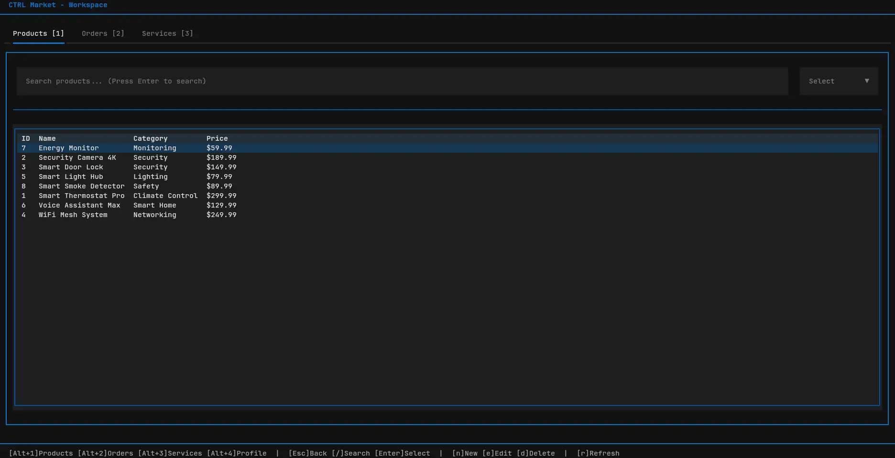

# CtrlMarket

A Smart Equipment Sales & Services Textual User Interface (TUI) application built with Python 3.12+.

## Overview

CtrlMarket is a terminal-based application for managing equipment sales and service requests. It provides a full-featured interface for customers, specialists, and administrators to manage products, orders, and service requests.



## About This Project

This project was originally built as a university Database course assignment. I've decided to publish it anyways because I believe in the power of terminal-based applications for business operations. TUIs can be far more efficient than bloated web interfaces for many use cases.

Inspired by [terminal.shop](https://terminal.shop) from ThePrimeagen, I encourage deploying applications like this over SSH. This approach offers:
- **Speed**: Terminal interfaces are instant and lightweight
- **Accessibility**: Works over any SSH connection, even on mobile
- **Simplicity**: No browser, no JavaScript, no CSS headaches
- **Security**: Fewer attack vectors than web applications

If you're running a business, consider whether a TUI could serve your team better than another React dashboard.

## Personal Recommendations

If you're building something similar:

- **Use an ORM**: I only used raw SQL because the assignment required it. In production, use SQLAlchemy, Drizzle, or similar. It makes migrations, relationships, and queries much cleaner.
- **Consider Rust or TypeScript for TUIs**: For new projects, I'd recommend [ratatui](https://github.com/ratatui-org/ratatui) (Rust) or libraries built on it. Python's Textual is great for prototyping, but Rust's compile-time guarantees and performance make it ideal for terminal applications.

## Features

- **User Management**: Sign up, login, and role-based access (Customer, Specialist, Admin)
- **Product Catalog**: Browse and manage equipment products with categories and pricing
- **Order System**: Create and track orders with multiple items
- **Service Requests**: Request installation or support services
- **Dashboard**: Overview of orders, services, and key metrics

## Tech Stack

- **Language**: Python 3.12+
- **TUI Framework**: [Textual](https://textual.textualize.io/)
- **Data Validation**: Pydantic v2
- **Database**: SQLite (raw SQL, no ORM)
- **Authentication**: bcrypt for password hashing
- **Testing**: pytest

## Project Structure

```
ctrlmarket/
├── database/
│   ├── connection.py    # Database connection management
│   ├── queries.py       # Raw SQL queries
│   ├── schema.sql       # Database schema
│   └── seed_data.sql    # Sample data
├── models/
│   └── __init__.py      # Pydantic models
├── tui/
│   ├── app.py           # Main TUI application
│   ├── screens/         # Screen widgets
│   └── css/             # Styling
├── tests/
│   ├── test_database/   # Database tests
│   ├── test_models/     # Model validation tests
│   └── test_tui/        # TUI component tests
├── main.py              # Entry point
├── pyproject.toml       # Project configuration
└── README.md
```

## Getting Started

### Prerequisites

- Python 3.12 or higher
- uv (recommended) or pip

### Installation

1. Clone the repository:
   ```bash
   git clone <repository-url>
   cd ctrlmarket
   ```

2. Install dependencies:
   ```bash
   uv sync
   ```

### Running the Application

```bash
uv run main.py
```

### Running Tests

```bash
uv run pytest
```

### Code Quality

```bash
# Lint code
ruff check .

# Format code
ruff format .
```

## Database Schema

The application uses SQLite with the following entities:

- **User**: Customers, Specialists, and Administrators
- **Product**: Equipment products with name, category, and price
- **Order**: Customer orders with status tracking
- **OrderItem**: Line items linking orders to products
- **ServiceRequest**: Installation and support service requests

All relationships are enforced via foreign key constraints.

## License

MIT
